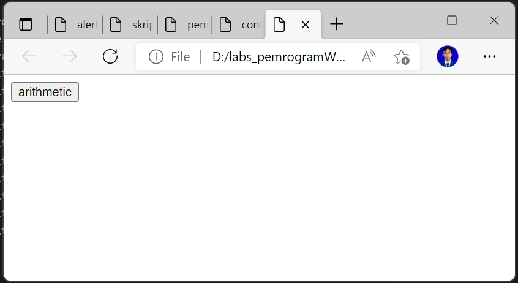
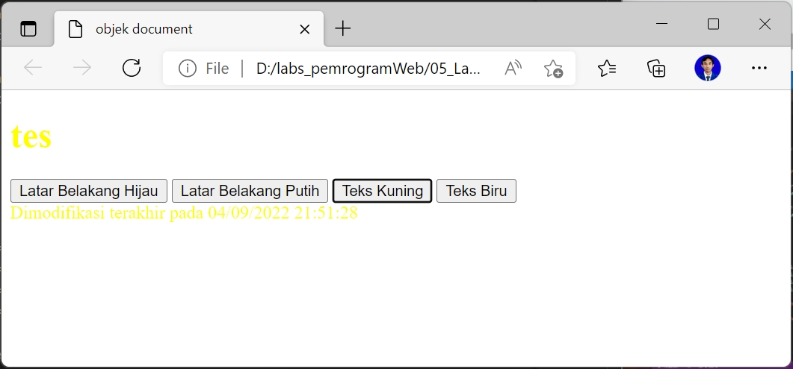
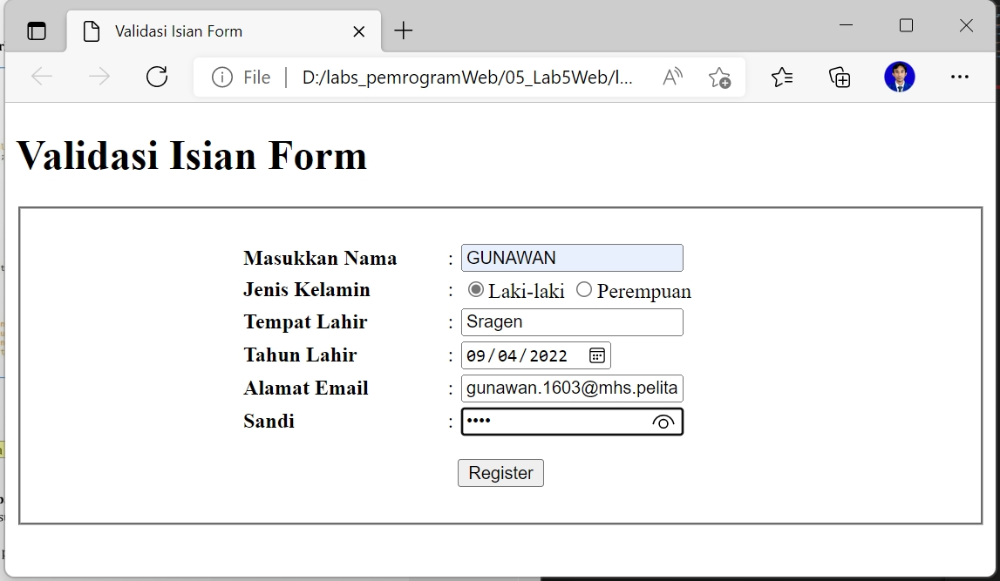

# 05_Lab5Web
TUGAS PERTEMUAN 6

PEMROGRAMAN WEB

TEKNIK INFORMATIKA

UNIVERSITAS PELITA BANGSA

NAMA  : GUNAWAN

NIM   : 312010191

KELAS : TI.20.B1

DOSEN : Agung Nugroho,S.Kom.,M.Kom

# Pemrograman Web: Javascript

**Instruksi Praktikum**
1. Persiapkan text editor misalnya VSCode.
2. Buat folder baru dengan nama lab5_javascript.
3. Ikuti langkah-langkah praktikum yang akan dijelaskan berikutnya.
4. Lakukan validasi dokumen html dengan mengakses http://validator.w3.org<br>

**Langkah-langkah Praktikum**
Persiapan membuat dokumen HTML dengan nama file **lab5_javascript.html** seperti berikut.<br>

~~~
<!DOCTYPE html>
<html lang="en">
<head>
<title>Mengenal JavaScript</title>
</head>
<body>
<h1>Pengenalan JavaScript</h1>
<h3>Contoh document.write dan console.log</h3>
<script>
document.write("Hello World");
console.log("Hello World");
</script>
</body>
</html>
~~~


Berikut tampilan pada Browser :


Gambar 01.Tampilan Contoh Javascript

# **Javascrip Dasar**<br>
**Pemakaian Alert sebagai property window.**<br>
~~~
<!DOCTYPE html>
<html lang="en">
<head>
    <title>alert box</title>
</head>
<body>
    <script language = "javascript">
 <!--
  window.alert("ini merupakan pesan untuk anda");
    </script>
</body>
</html>
~~~


Berikut tampilan pada Browser :


Gambar 02.Tampilan Pemakaian Alert sebagai property window

**Pemakaian method dalam objek :**

```
<!DOCTYPE html>
<html lang="en">
<head>
   <title>skrip javascript</title>
</head>
<body>
   percobaan memakai javascript:<br>
   <script language = "javascript">
<!--
document.write("selamat mencoba javascript<br>");
document.write("semoga sukses");
//-->
   </script>
</body>
</html>
```


Berikut tampilan pada Browser :


Gambar 03.Tampilan Pemakaian method dalam objek

**Pemakaian Prompt**
```
<!DOCTYPE html>
<html lang="en">
<head>
    <title>pemasukan data</title>
</head>
<body>
    <script language = "javascript">
 <!--
 var nama = prompt("siapa nama anda?","masukan nama anda");
 document.write("hai, " + nama);
 //-->
    </script>
</body>
</html>
```


Berikut tampilan pada Browser :

<br>


Gambar 04.Tampilan Pemakaian Prompt

**Pembuatan fungsi dan cara pemanggilannya**
```
<!DOCTYPE html>
<html lang="en">
<head>
    <title>contoh program javascript</title>
    <script language = "javascript">
    function pesan(){
        alert ("memanggil javascript lewat body onload")
    }
    </script>
</head>
<body onload=pesan()>
</body>
</html>
```


Berikut tampilan pada Browser :


Gambar 05.Tampilan Pembuatan fungsi dan cara pemanggilannya

# Dasar Pemrograman Di Javascript

**Operasi dasar aritmatika**<br>
```
<!DOCTYPE html>
<html lang="en">
<head>
    <title>contoh program javascript</title>
    <script language = "javascript">
    function test (val1,val2){
        document.write("<br>"+"perkalian : val1*val2"+"<br>")
        document.write(val1*val2)
        document.write("<br>"+"pembagian : val1/val2"+"<br>")
        document.write(val1/val2)
        document.write("<br>"+"penjumlahan : val1+val2 "+"<br>")
        document.write(val1+val2)
        document.write("<br>"+"pengurangan : val1-val2 "+"<br>")
        document.write(val1-val2)
        document.write("<br>"+"modulus : val1%val2 "+"<br>")
        document.write(val1%val2)
    }
    </script>
</head>
<body>
    <input type="button" name="button1" value="arithmetic" onclick=test(9,4)>
</body>
</html>
```


Berikut tampilan pada Browser :

<br>


Gambar 06.Tampilan Operasi dasar aritmatika

**Seleksi kondisi (if..else)**
```
<!DOCTYPE html>
<html lang="en">
<head>
    <title>contoh if-else</title>
</head>
<body>
    <script language = "javascript">
        <!--
        var nilai = prompt("nilai (0-100): ", 0);
        var hasil = "";
        if (nilai >= 60)
        hasil = "lulus";
        else
        hasil = "tidak lulus";
        document.write("hasil: " + hasil);
        //-->
    </script>
</body>
</html>
```


Berikut tampilan pada Browser :

<br>


Gambar 07.Tampilan Seleksi kondisi (if..else)

**Penggunaan operator switch untuk seleksi kondisi**
```
<!DOCTYPE html>
<html lang="en">
<head>
    <title>contoh contoh javascript</title>
    <script language = "javascript">
        function test()
        {
            val1=window.prompt("input nilai (1-5):")
            switch (val1)
            {
                case "1" :
                    document.write("bilangan satu")
                    break
                case "2" :
                    document.write("bilangan dua")
                    break
                case "3" :
                    document.write("bilangan tiga")
                    break
                case "4" :
                    document.write("bilangan empat")
                    break
                case "5" :
                    document.write("bilangan lima")
                    break
                default :
                document.write("bilangan lainnya")
            }
        }
    </script>
</head>
<body>
    <input type="button" name="button1" value="switch" onclick=test()>
</body>
</html>
```


Berikut tampilan pada Browser :

<br>
<br>
<br>

Gambar 08.Tampilan operator switch untuk seleksi kondisi

# Pembuatan Form

**Form Input**

```
<!DOCTYPE html>
<html>
<head>
    <script language = "javascript">
        function test()
        {
            var val1=document.kirim.T1.value
            if (val1%2==0)
                document.kirim.T2.value="bilangan genap"
            else
                document.kirim.T2.value="bilangan ganjil"
        }
    </script>
</head>
<body>
    <form method="POST" name="kirim">
        <p>BIL <input type="text" name="T1" size="20">
        MERUPAKAN BIL <INPUT TYPE="text" name="T2" size="20"></p>
            <p><input type="button" value="TEBAK" name="B1" onclick=test()></p>
    </form>
</body>
</html>
```


Berikut tampilan pada Browser :

<br>

Gambar 09.Tampilan Form Input

**Form Button.**
```
<!DOCTYPE html>
<html>
<head>
    <title>objek document</title>
</head>
<body>
    <script language ="javascript">
        <!--
        function ubahWarnaLB(warna) {
            document.bgColor = warna;
        }
        function ubahWarnaLD(warna) {
            document.fgColor = warna;
        }
        //-->
    </script>

    <h1>tes</h1>
    <form>
        <input type="button" value="Latar Belakang Hijau" onclick="ubahWarnaLB('GREEN')">
        <input type="button" value="Latar Belakang Putih" onclick="ubahWarnaLB('WHITE')">
        <input type="button" value="Teks Kuning" onclick="ubahWarnaLD('YELLOW')">
        <input type="button" value="Teks Biru" onclick="ubahWarnaLD('BLUE')">
    </form>
    <script language ="javascript">
        <!--
            document.write("Dimodifikasi terakhir pada " + document.lastModified);
        //-->
    </script>
</body>
</html>
```


Berikut tampilan pada Browser :

<br>
<br>
<br>
<br>
<br>

Gambar 10.Tampilan Form Button

# HTML DOM

**Pilihan menggunakan checkBox dengan perhitungan otomatis**

```
<!DOCTYPE html>
<html>
<head>
    <title>Daftar Menu</title>
    <script>
        function hitung(ele){
            var total = document.getElementById('total').value;
                total = (total ? parseInt(total) : 0);
            var harga = 0;
            if (ele.checked) {
                harga = ele.value;
                total += parseInt(harga);
            } else{
                harga = ele.value;
                if (total > 0)
                    total -= parseInt(harga);
            }
            document.getElementById('total').value = total;
        }
    </script>
</head>
<body>
    <h1>Daftar Menu Makanan</h1>
    <label><input type="checkbox" value='5000' id="menu1" onclick="hitung(this);"/> Ayam Goreng Rp. 5.000</label><br/>
    <label><input type="checkbox" value='500' id="menu2" onclick="hitung(this);"/> Tempe Goreng Rp. 500</label><br/>
    <label><input type="checkbox" value='2500' id="menu3" onclick="hitung(this);"/> Telur Dadar Rp. 2.500</label><br/>
    <strong>Total Bayar: Rp. <input id='total' type="text"/></strong>
</body>
</html>
```


Berikut tampilan pada Browser :

<br>
<br>

Gambar 11.Tampilan checkBox dengan perhitungan otomatis

# Pertanyaan dan Tugas

1. Buat script untuk melakukan validasi pada isian form.<br>
>**Jawab:**
```
<!DOCTYPE html>
<html>
<head>
<title>Validasi Isian Form</title>
</head>
<body>
    <h1>Validasi Isian Form</h1>
<form>
    <fieldset>
        <br/>
        <form action="" method="post" onSubmit="return validasi_data(this)">
        <table border="0" width="400" align="center">
        <tr>
        <th align="left">Masukkan Nama</th>
        <td>:</td>
        <td><input type="text" name="nama" id="nama"></td>
        </tr>
        <tr>
        <th align="left">Jenis Kelamin</th>
        <td>:</td>
        <td><input type="radio" name="jeniskelamin" value="L" id="jeniskelamin" checked="checked">Laki-laki
        <input type="radio" name="jeniskelamin" value="P">Perempuan</td>
        </tr>
        <tr>
        <th align="left">Tempat Lahir</th>
        <td>:</td>
        <td><input type="text" name="tempat" id="tempat"></td>
        </tr>
        <tr>
        <th align="left">Tahun Lahir</th>
        <td>:</td>
        <td><input type="date" name="tgl" id="tgl"></td>
        </tr>
        <tr>
        <th align="left">Alamat Email</th>
        <td>:</td>
        <td><input type="email" name="email" id="email"></td>
        </tr>
        <tr>
        <th align="left">Sandi</th>
        <td>:</td>
        <td><input type="password" name="sandi" id="sansi"></td>
        </tr>
        <tr>
        <td colspan="3" align="center" height="50"><input type="submit" name="" id="" value="Register"></td>
        </tr>
        </table>
        </form>
     </body>
     <script type="text/javascript">
     function validasi_data(form) {  
    if (form.nama.value=="") {
      alert('nama  harus di isi !');
      form.nama.focus();
      return false;
    }else if(form.tempat.value=="") {
      alert('Tempat Lahir harus di isi !');
      form.tempat.focus();
      return false;
    }
    }
    </fieldset>
</form>
</script>
</html>
```

> 

Berikut tampilan pada Browser :

<br>


Cukup Sekian Penjelasan Dari Saya

**TERIMAKASIH**


